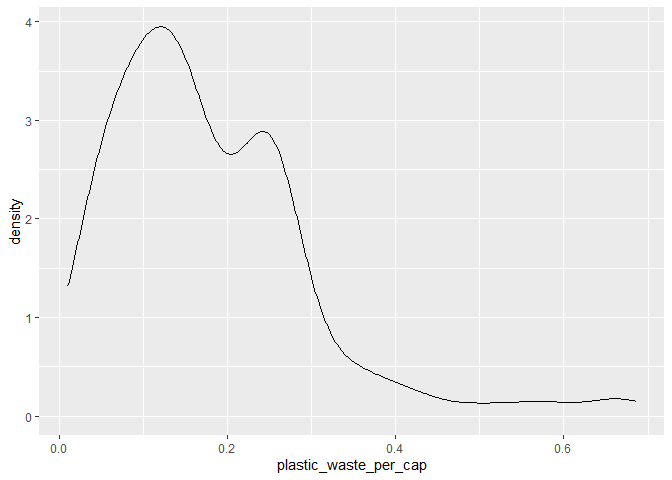

Lab 02 - Plastic waste
================
Élodie Lefebvre
22 septembre 2025

## Chargement des packages et des données

``` r
library(tidyverse) 
```

``` r
plastic_waste <- read_csv("data/plastic-waste.csv")
```

Commençons par filtrer les données pour retirer le point représenté par
Trinité et Tobago (TTO) qui est un outlier.

``` r
plastic_waste <- plastic_waste %>%
  filter(plastic_waste_per_cap < 3.5)
```

## Exercices

### Exercise 1

``` r
ggplot(data = plastic_waste, aes(x = plastic_waste_per_cap)) + 
               geom_histogram(binwidth = 0.2) +
 facet_grid(. ~ continent)
```

<!-- -->

### Exercise 2

``` r
ggplot(plastic_waste, aes(x = plastic_waste_per_cap)) +
         geom_density() 
```

<!-- -->

``` r
ggplot(plastic_waste, aes(x = plastic_waste_per_cap, color = continent)) +
         geom_density() 
```

<!-- -->

``` r
ggplot(plastic_waste, aes(x = plastic_waste_per_cap, color = continent, fill = continent)) +
         geom_density() 
```

<!-- -->

``` r
ggplot(plastic_waste, aes(x = plastic_waste_per_cap, color = continent, fill = continent)) +
         geom_density(adjust = 1, 
               alpha = 0.4) 
```

<!-- -->

Les réglages de couleurs dépendent des variables, alors que les réglages
de transparence s’appliquent à toutes les variables. C’est pourquoi la
couleur est dans aes et que la transparence est dans geom_density

### Exercise 3

Boxplot:

``` r
ggplot(plastic_waste, aes(x = continent,
                  y = plastic_waste_per_cap)) +
  geom_boxplot()
```

<!-- -->

Violin plot:

``` r
ggplot(plastic_waste, aes(x = continent,
                  y = plastic_waste_per_cap)) +
  geom_violin()
```

<!-- -->

Le violin plot permet de voir la distribution complète des données, ce
que ne permet pas box plot

### Exercise 4

``` r
ggplot(plastic_waste, aes(x = plastic_waste_per_cap,
                  y = mismanaged_plastic_waste_per_cap, color = continent)) +
  geom_point()
```

<!-- --> plus
le nombre de déchets générés est grand, le nombre de déchets non gérés a
tendance à augmenter aussi

### Exercise 5

``` r
ggplot(plastic_waste, aes(x = total_pop,
                  y = plastic_waste_per_cap)) +
  geom_point()
```

    ## Warning: Removed 10 rows containing missing values or values outside the scale range
    ## (`geom_point()`).

<!-- -->

``` r
ggplot(plastic_waste, aes(x = coastal_pop,
                  y = plastic_waste_per_cap)) +
  geom_point()
```

<!-- -->

Non, les relations entre les deux paires de variables semblent être
équivalentes.

## Conclusion

Recréez la visualisation:

``` r
ggplot(plastic_waste_coastal <- plastic_waste %>% 
  mutate(coastal_pop_prop = coastal_pop / total_pop) %>%
  filter(plastic_waste_per_cap < 3), aes(x = coastal_pop_prop,
                  y = plastic_waste_per_cap)) +
  geom_point(aes(color = continent)) +
  geom_smooth(color = "black")
```

    ## `geom_smooth()` using method = 'loess' and formula = 'y ~ x'

    ## Warning: Removed 10 rows containing non-finite outside the scale range
    ## (`stat_smooth()`).

    ## Warning: Removed 10 rows containing missing values or values outside the scale range
    ## (`geom_point()`).

<!-- --> La courbe est
plutôt horizontale, ce qui signifie qu’il n’y a pas de relation
significative entre le nombre de déchets plastiques produits et le ratio
de personnes habitants sur les côtes/population totales des pays
